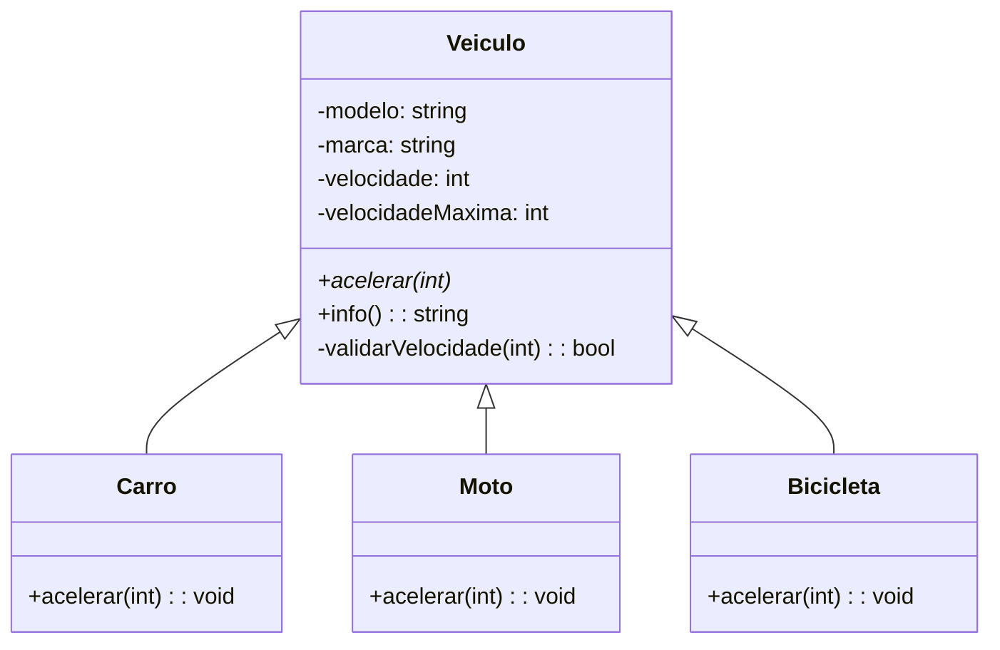
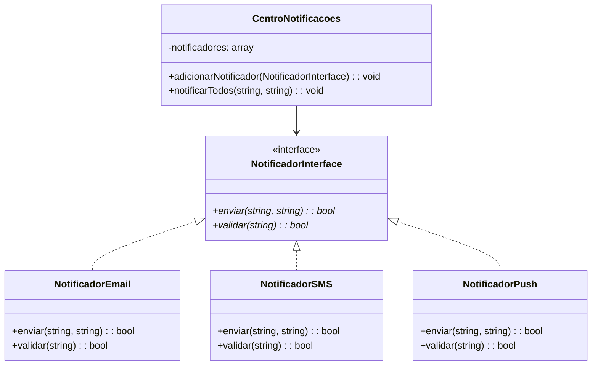
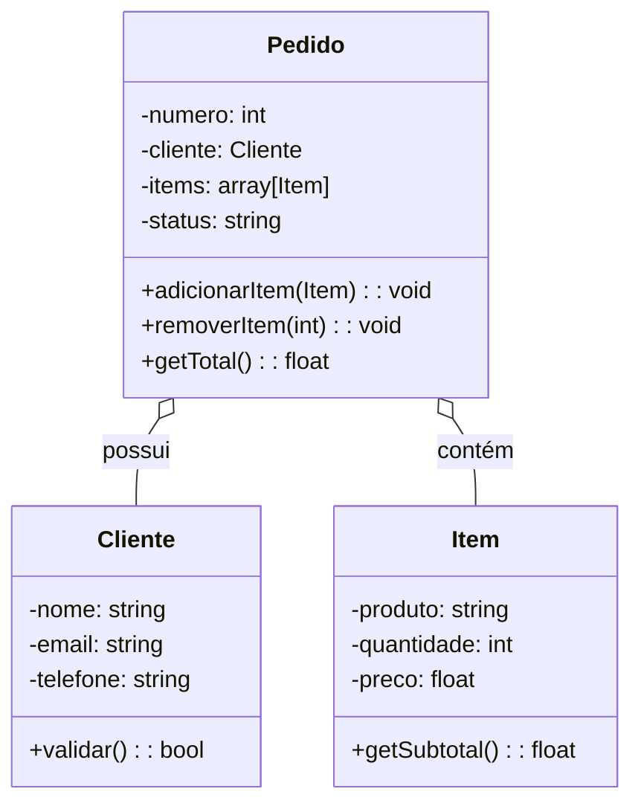
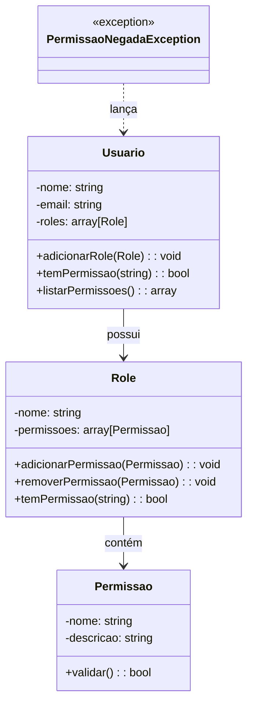
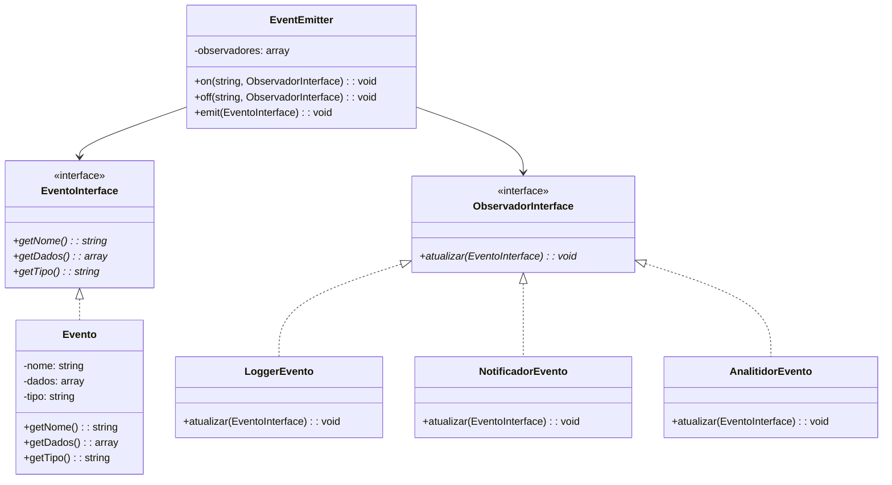
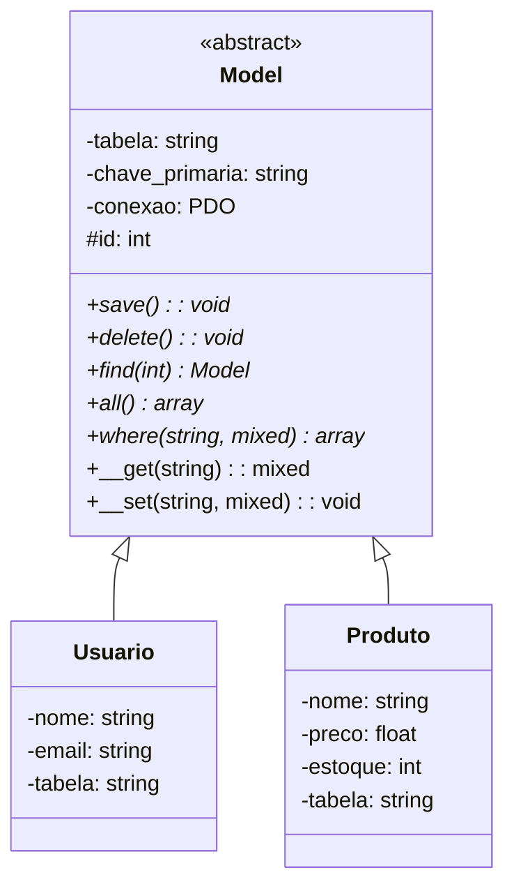

# Exercícios de Programação Orientada a Objetos em PHP

Exercícios progressivos aplicando conceitos diversos de POO.

---

## 1. Herança e Polimorfismo - Sistema de Veículos

### Diagrama UML



### Objetivo
Criar uma hierarquia de classes que demonstre herança e polimorfismo com diferentes tipos de veículos.

### Requisitos
- Classe abstrata `Veiculo` com:
  - Propriedades: `$modelo`, `$marca`, `$velocidadeMaxima`
  - Método abstrato: `acelerar()`
  - Método concreto: `info()`

- Classes filhas:
  - `Carro`: implementa `acelerar()` com aceleração progressiva
  - `Moto`: implementa `acelerar()` mais rápido que carro
  - `Bicicleta`: implementa `acelerar()` com limite de velocidade

- Validações:
  - Velocidade não pode ser negativa
  - Velocidade não pode ultrapassar velocidade máxima
  - Marca e modelo não podem ser vazios

### Exemplo de Uso
```php
$carro = new Carro("Toyota", "Corolla", 200);
$carro->acelerar(50);  // Acelerou de 0 para 50
echo $carro->info();   // Toyota Corolla está a 50 km/h
```

---

## 2. Encapsulamento - Sistema de Conta Bancária

### Objetivo
Implementar encapsulamento com getters/setters e validações.

### Requisitos
- Classe `ContaBancaria` com:
  - Propriedades privadas: `$saldo`, `$titular`, `$numeroConta`, `$agencia`
  - Métodos: `depositar()`, `sacar()`, `transferir()`, `getSaldo()`
  
- Validações:
  - Saldo não pode ser negativo
  - Saque não pode ser maior que saldo
  - Transferência valida conta origem e destino
  - Titular deve ter 2-100 caracteres
  - Saldo mínimo: R$ 1,00

- Exceção customizada: `TransferenciaException`

### Exemplo de Uso
```php
$conta1 = new ContaBancaria("João Silva", "001", "12345");
$conta1->depositar(1000);
$conta1->sacar(100);
echo $conta1->getSaldo();  // 900
```

---

## 3. Interfaces - Sistema de Notificações

### Diagrama UML



### Objetivo
Criar diferentes canais de notificação usando interfaces.

### Requisitos
- Interface `NotificadorInterface` com:
  - `enviar($destinatario, $mensagem): bool`
  - `validar($destinatario): bool`

- Implementações:
  - `NotificadorEmail`: valida formato email, envia via email
  - `NotificadorSMS`: valida telefone (11 dígitos), envia via SMS
  - `NotificadorPush`: valida device ID, envia push notification

- Classe `CentroNotificacoes`:
  - Array de notificadores
  - Método `adicionarNotificador(NotificadorInterface $n)`
  - Método `notificarTodos($destinatario, $mensagem)`

### Exemplo de Uso
```php
$centro = new CentroNotificacoes();
$centro->adicionarNotificador(new NotificadorEmail());
$centro->adicionarNotificador(new NotificadorSMS());
$centro->notificarTodos("maria@email.com", "Olá!");
```

---

## 4. Composição - Sistema de Pedidos

### Diagrama UML



### Objetivo
Demonstrar composição ao invés de herança.

### Requisitos
- Classe `Item`:
  - Propriedades: `$produto`, `$quantidade`, `$preco`
  - Método: `getSubtotal()`

- Classe `Pedido`:
  - Propriedades: `$numero`, `$cliente`, `$items[]`, `$status`
  - Métodos: `adicionarItem()`, `removerItem()`, `getTotal()`, `getStatus()`
  
- Classe `Cliente`:
  - Propriedades: `$nome`, `$email`, `$telefone`
  - Método: `validar()`

- Validações:
  - Item com quantidade negativa
  - Pedido sem itens
  - Cliente sem nome
  - Status válidos: "pendente", "processado", "entregue", "cancelado"

### Exemplo de Uso
```php
$cliente = new Cliente("Maria", "maria@email.com", "11999999999");
$pedido = new Pedido(1, $cliente);
$pedido->adicionarItem("Notebook", 1, 3000);
$pedido->adicionarItem("Mouse", 2, 50);
echo $pedido->getTotal();  // 3100
```

---

## 5. Traits - Logging e Timestamp

### Objetivo
Usar traits para adicionar funcionalidades comuns a múltiplas classes.

### Requisitos
- Trait `Logavel`:
  - Propriedade: `$logs[]`
  - Métodos: `adicionarLog()`, `getLogs()`

- Trait `ComTimestamp`:
  - Propriedades: `$dataCriacao`, `$dataAtualizacao`
  - Métodos: `setDataAtualizacao()`, `getIdade()`

- Classe `Produto` com traits Logavel e ComTimestamp:
  - Propriedades: `$nome`, `$preco`, `$estoque`
  - Qualquer alteração registra log e atualiza data

- Classe `Usuario` com trait Logavel:
  - Propriedades: `$nome`, `$email`
  - Logar login, logout, alterações

### Exemplo de Uso
```php
$produto = new Produto("Teclado", 150, 10);
$produto->atualizarEstoque(5);
print_r($produto->getLogs());
// Array ( [0] => "Estoque atualizado de 10 para 5 em 2024-01-15 10:30:45" )
```

---

## 6. Padrão Singleton - Configuração

### Objetivo
Implementar singleton para gerenciar configurações globais.

### Requisitos
- Classe `Config` (Singleton):
  - Propriedade privada estática: `$instancia`
  - Método privado: `__construct()`
  - Método estático: `getInstance()`
  - Métodos: `set()`, `get()`, `getAll()`

- Validações:
  - Chaves de configuração não podem ser vazias
  - Valores devem ser string, int, float ou bool
  - Não permitir alteração de chaves críticas (db, app_name)

### Exemplo de Uso
```php
$config = Config::getInstance();
$config->set("app_name", "Meu App");
$config->set("db_host", "localhost");

$config2 = Config::getInstance();  // Mesma instância
echo $config2->get("app_name");    // "Meu App"
```

---

## 7. Padrão Factory - Criação de Objetos

### Objetivo
Usar factory pattern para criar diferentes tipos de objetos.

### Requisitos
- Classe abstrata `FormaGeometrica`:
  - Métodos abstratos: `calcularArea()`, `calcularPerimetro()`

- Classe `Retangulo`, `Circulo`, `Triangulo` extend `FormaGeometrica`

- Classe `FormaFactory`:
  - Método estático: `criar($tipo, $parametros[])`
  - Tipos: "retangulo", "circulo", "triangulo"
  - Validações de parâmetros

### Exemplo de Uso
```php
$ret = FormaFactory::criar("retangulo", [5, 10]);
echo $ret->calcularArea();      // 50

$circ = FormaFactory::criar("circulo", [5]);
echo $circ->calcularArea();     // ~78.54
```

---

## 8. Polimorfismo com Type Hints

### Objetivo
Demonstrar polimorfismo com type hints em parâmetros.

### Requisitos
- Interface `ProcessadorPagamento` com:
  - `processar($valor): bool`
  - `validar($dados): bool`

- Implementações:
  - `ProcessadorCartao`: valida número cartão (16 dígitos)
  - `ProcessadorBoleto`: gera código de barras
  - `ProcessadorPix`: valida chave Pix

- Classe `TransacaoPagamento`:
  - Método: `pagar($valor, ProcessadorPagamento $processador)`
  - Registra qual processador foi usado
  - Valida antes de processar

### Exemplo de Uso
```php
$pag = new TransacaoPagamento();
$pag->pagar(100, new ProcessadorCartao());
$pag->pagar(100, new ProcessadorBoleto());
$pag->pagar(100, new ProcessadorPix());
```

---

## 9. Dependência Injection - Carrinho de Compras

### Objetivo
Implementar dependency injection para desacoplamento.

### Requisitos
- Interface `CalculadorDescontoInterface` com:
  - `calcular($valor): float`

- Implementações:
  - `DescontoFixo`: desconto de valor fixo
  - `DescontoPercentual`: desconto percentual
  - `SemDesconto`: sem desconto

- Classe `CarrinhoCompras`:
  - Injetar CalculadorDescontoInterface via construtor
  - Propriedades: `$items[]`, `$calculadorDesconto`
  - Métodos: `adicionarItem()`, `getTotal()`, `getTotalComDesconto()`

### Exemplo de Uso
```php
$carrinho = new CarrinhoCompras(new DescontoPercentual(10));
$carrinho->adicionarItem("Produto A", 100);
echo $carrinho->getTotal();         // 100
echo $carrinho->getTotalComDesconto(); // 90
```

---

## 10. Associações - Biblioteca

### Objetivo
Demonstrar diferentes tipos de associações (1:1, 1:N, N:N).

### Requisitos
- Classe `Livro`:
  - Propriedades: `$titulo`, `$autor`, `$isbn`, `$anoPublicacao`
  
- Classe `Autor`:
  - Propriedades: `$nome`, `$nacionalidade`
  - Array de livros (1:N)

- Classe `Categoria`:
  - Propriedades: `$nome`, `$descricao`
  - Array de livros (N:N)

- Classe `Biblioteca`:
  - Array de livros
  - Array de autores
  - Métodos: `adicionarLivro()`, `buscarPorAutor()`, `buscarPorCategoria()`, `listarTodos()`

### Exemplo de Uso
```php
$autor = new Autor("Machado de Assis", "Brasil");
$livro = new Livro("Dom Casmurro", $autor, "123-456", 1899);
$categoria = new Categoria("Romance", "Histórias de ficção");

$biblioteca = new Biblioteca();
$biblioteca->adicionarLivro($livro, $categoria);
```

---

## 11. Desafio: Sistema de Permissões

### Diagrama UML



### Objetivo
Criar um sistema robusto de controle de permissões.

### Requisitos
- Classe `Permissao`:
  - Propriedades: `$nome`, `$descricao`
  - Método: `validar()`

- Classe `Role`:
  - Propriedades: `$nome`, `$permissoes[]`
  - Métodos: `adicionarPermissao()`, `removerPermissao()`, `temPermissao()`

- Classe `Usuario`:
  - Propriedades: `$nome`, `$email`, `$roles[]`
  - Métodos: `adicionarRole()`, `temPermissao()`, `listarPermissoes()`

- Exceção: `PermissaoNegadaException`

### Validações
- Nome de permissão/role não pode ser vazio
- Não permitir duplicatas
- Usuário sem roles não tem permissão
- Validar antes de conceder acesso

### Exemplo de Uso
```php
$permLer = new Permissao("ler", "Pode ler conteúdo");
$permEscrever = new Permissao("escrever", "Pode escrever conteúdo");

$roleEditor = new Role("Editor");
$roleEditor->adicionarPermissao($permLer);
$roleEditor->adicionarPermissao($permEscrever);

$usuario = new Usuario("João", "joao@email.com");
$usuario->adicionarRole($roleEditor);

if($usuario->temPermissao("escrever")) {
    echo "João pode escrever";
}
```

---

## 12. Desafio: Sistema de Eventos

### Diagrama UML (Padrão Observer)



### Objetivo
Implementar padrão Observer com eventos.

### Requisitos
- Interface `ObservadorInterface`:
  - `atualizar(EventoInterface $evento)`

- Interface `EventoInterface`:
  - `getNome()`, `getDados()`, `getTipo()`

- Classe `Evento` implements `EventoInterface`

- Classe `EventEmitter`:
  - Registrar observadores
  - Emitir eventos
  - Remover observadores
  - Métodos: `on()`, `off()`, `emit()`

- Classes observadoras:
  - `LoggerEvento`: registra eventos em log
  - `NotificadorEvento`: envia notificações
  - `AnalitidorEvento`: analisa dados

### Exemplo de Uso
```php
$emitter = new EventEmitter();
$emitter->on("usuario.criado", new LoggerEvento());
$emitter->on("usuario.criado", new NotificadorEvento());

$evento = new Evento("usuario.criado", ["id" => 1, "nome" => "Maria"]);
$emitter->emit($evento);
// Logger e Notificador são acionados automaticamente
```

---

## 13. Desafio: Cache com Decorator

### Objetivo
Implementar padrão Decorator para adicionar cache.

### Requisitos
- Interface `RepositorioInterface`:
  - `buscarPorId($id)`
  - `buscarTodos()`
  - `salvar($objeto)`

- Classe `RepositorioUsuario` implements `RepositorioInterface`

- Classe `RepositorioCom Cache` implements `RepositorioInterface`:
  - Decora repositório
  - Cache em memória (array)
  - TTL (time to live) configurável
  - Validar cache antes de usar

### Exemplo de Uso
```php
$repo = new RepositorioUsuario();
$repoComCache = new RepositorioComCache($repo, 3600);  // 1 hora

$usuario = $repoComCache->buscarPorId(1);  // Busca BD
$usuario = $repoComCache->buscarPorId(1);  // Vem do cache
```

---

## 14. Desafio: Validador Fluente

### Objetivo
Criar um validador com interface fluente.

### Requisitos
- Classe `Validador`:
  - Métodos encadeáveis (retornam $this)
  - Validações: `string()`, `email()`, `numero()`, `minimo()`, `maximo()`, `tamanho()`, `customizado()`
  - Método: `validar($valor): bool`
  - Método: `getErros(): array`

### Exemplo de Uso
```php
$v = new Validador();
$v->string()
  ->tamanho(2, 100)
  ->customizado(fn($v) => strpos($v, "Silva") !== false);

if(!$v->validar("Maria Silva")) {
    print_r($v->getErros());
}
```

---

## 15. Desafio: ORM Simples

### Diagrama UML



### Objetivo
Criar um mini ORM (Object-Relational Mapping).

### Requisitos
- Classe abstrata `Model`:
  - Propriedades: `$tabela`, `$chave_primaria`, `$conexao`
  - Métodos: `save()`, `delete()`, `find($id)`, `all()`, `where($coluna, $valor)`
  - Magic methods: `__get()`, `__set()`

- Classe `Usuario` extends `Model`
- Classe `Produto` extends `Model`

- Validações:
  - Verificar se tabela existe
  - Validar tipos de dados antes de salvar
  - Tratamento de exceções

### Exemplo de Uso
```php
$usuario = new Usuario();
$usuario->nome = "João";
$usuario->email = "joao@email.com";
$usuario->save();  // INSERT

$usuario = Usuario::find(1);
$usuario->nome = "João Silva";
$usuario->save();  // UPDATE

$usuarios = Usuario::all();
$usuarios = Usuario::where("nome", "João")->all();
```

---

## Conceitos Cobertos

- ✅ Herança
- ✅ Polimorfismo
- ✅ Encapsulamento
- ✅ Interfaces
- ✅ Traits
- ✅ Classes Abstratas
- ✅ Composição
- ✅ Dependency Injection
- ✅ Padrões de Design (Singleton, Factory, Observer, Decorator)
- ✅ Validação e Exceções
- ✅ Magic Methods
- ✅ Associações (1:1, 1:N, N:N)
- ✅ Type Hints
- ✅ Encadeamento de Métodos (Fluent Interface)

